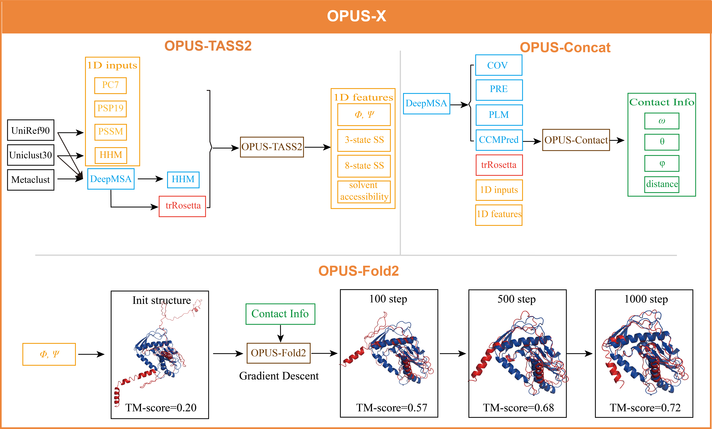
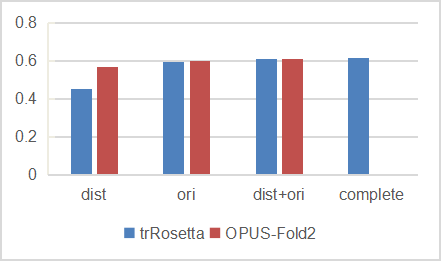
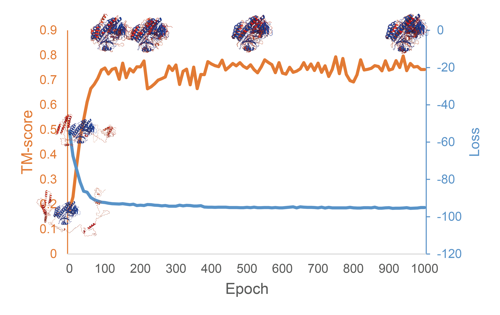
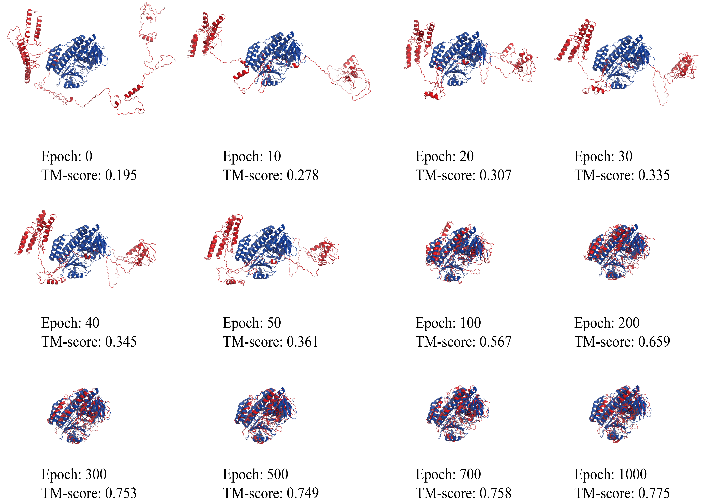

# OPUS-X

**Motivation:** The development of an open-source platform to predict protein 1D features and 3D structure is an important task. In this paper, we report an open-source toolkit for protein 3D structure modeling, named OPUS-X. It contains three modules: OPUS-TASS2, which predicts protein torsion angles, secondary structure and solvent accessibility; OPUS-Contact, which measures the distance and orientations information between different residue pairs; and OPUS-Fold2, which uses the constraints derived from the first two modules to guide folding.

**Results:** OPUS-TASS2 is an upgraded version of our previous method OPUSS-TASS. OPUS-TASS2 integrates protein global structure information and significantly outperforms OPUS-TASS. OPUS-Contact combines multiple raw co-evolutionary features with protein 1D features predicted by OPUS-TASS2, and delivers better results than the open-source state-of-the-art method trRosetta. OPUS-Fold2 is a complementary version of our previous method OPUS-Fold. OPUS-Fold2 is a gradient-based protein folding framework based on the differentiable energy terms in opposed to OPUS-Fold that is a sampling-based method used to deal with the non-differentiable terms. OPUS-Fold2 exhibits comparable performance to the Rosetta folding protocol in trRosetta when using identical inputs. OPUS-Fold2 is written in Python and TensorFlow2.4, which is user-friendly to any source-code level modification. 

## Framework of OPUS-X



## Usage

### Dependency

```
Python 3.7
TensorFlow 2.4
hh-suite3
```

The standalone version of OPUS-X is hosted on [Baidu Drive](https://pan.baidu.com/s/1ySqn_tKTQidS5AzUJEFt6Q) with password `93sa`. The corresponding files for the testsets (CAMEO-Hard61 (60), CAMEO (78), CASP13 (26), and CASP14 (15)) we used can be downloaded from [Baidu Drive](https://pan.baidu.com/s/1SacrMCpclsAiKdoPuJx0ng) with password `2tn4`.

## Useful Tools

### Generate PSSM and HHM

More information about generating `pssm` and `hhm` can be found in our [OPUS-TASS repo](https://github.com/thuxugang/opus_tass).

### DeepMSA

[DeepMSA](https://zhanglab.ccmb.med.umich.edu/DeepMSA/)

### trRosetta

[trRosetta](https://yanglab.nankai.edu.cn/trRosetta/)

### CCMPed (already included)

[CCMPed](https://github.com/soedinglab/CCMpred)

### ResPRE (already included)

[ResPRE](https://github.com/leeyang/ResPRE)

## Run OPUS-TASS2_and_Contact

1. Change `hhsuite3_path` to your local **hh-suite3** path.
2. Put `pssm` (generated by **psiblast**), `hhm` (generated by **hh-suite3**), `aln` (generated by **DeepMSA**) and `npz` (generated by **trRosetta**) to `OPUS-TASS2_and_Contact\tmp_files`. Note that `npz` can also be generated from other predictors that output trRosetta-style's results.

## Run OPUS-Fold2

1. Change `trr_cons_path` to your trRosetta-style's outputs path. Here, we use the outputs from OPUS-Contact (\*.contact.npz)
2. Change `init_torsions` to your OPUS-TASS2 outputs path (\*.tass2).

## Results

### Performance of OPUS-TASS2

#### CAMEO-Hard61 (60)

|Predictors|SS3|SS8|MAE(ϕ)|MAE(ψ)|ASA|
|:----:|:----:|:----:|:----:|:----:|:----:|
|NetSurfP-2.0|	83.78|	70.38	|20.1|	29.99|	0.779|
|SPOT-1D|	83.69	|70.72|	19.55|	29.97|	0.775|
|OPUS-TASS|	84.15|	72.12	|19.26|	29.47	|-|
|OPUS-TASS2	|**84.55**	|**72.5**	|**19.07**	|**28.79**|	**0.797**|

#### CASP-FM (56)

|Predictors|SS3|SS8|MAE(ϕ)|MAE(ψ)|ASA|
|:----:|:----:|:----:|:----:|:----:|:----:|
|NetSurfP-2.0|	80.68|	69.14	|19.94|	31.43|	0.749|
|SPOT-1D	|82.37|	71.11	|19.39|	30.1	|0.744|
|OPUS-TASS|	83.4|73.27|	18.85	|28|	-|
|OPUS-TASS2	|**85.96**|	**76.28**|**17.94**|**25.17**|	**0.804**|

#### CASP14 (15)

|Predictors|SS3|SS8|MAE(ϕ)|MAE(ψ)|ASA|
|:----:|:----:|:----:|:----:|:----:|:----:|
|NetSurfP-2.0|75.39|	61.87|	22.62	|40.54|	0.68|
|SPOT-1D|	75.19	|61.41|	23.19|	43.98	|0.663|
|OPUS-TASS|	77.3	|63.53	|21.91	|38.93|	-|
|OPUS-TASS2|	**80.87**	| **68.26**	| **20.53**	|**33.48**|	**0.735**|

### Performance of OPUS-Contact

We use the TM-score to measure the accuracy of the predicted 3D structures obtained using trRosetta and OPUS-Contact outputs information as the constraints in trRosetta folding protocol, respectively.

|Predictors|CAMEO-Hard61 (60)|CAMEO (78)|CASP13 (26)|CASP14 (15)|
|:----:|:----:|:----:|:----:|:----:|
|trRosetta| 	0.600  |	0.668  |	0.659 |	0.427 |
|OPUS-Contact|	**0.616** 	|**0.684**  |	**0.671** |	**0.469**  |

### Performance of OPUS-Fold2

We compare the folding performance of OPUS-Fold2 and the Rosetta folding protocol in trRosetta on CAMEO-Hard61 (60). `dist` denotes the prediction obtained by distance-guided folding exclusively, `ori` denotes the prediction obtained by orientations-guided (ω, θ and φ) folding exclusively, `dist+ori` denotes the prediction obtained using both of them, and `complete` denotes the prediction obtained using trRosetta’s original complete energy terms (including the ramachandran, the omega, the van der Waals (vdw), and the centroid backbone hydrogen bonding (cen_hb) terms)



### Case study of OPUS-Fold2

OPUS-Fold2 optimization process of target 2020-01-18_00000081_1.pdb (with 444 residues in length) in CAMEO-Hard61 (60).



Some intermediate structures of target 6BZT_D_21_522.pdb (with 501 residues in length) during the optimization process of OPUS-Fold2.



